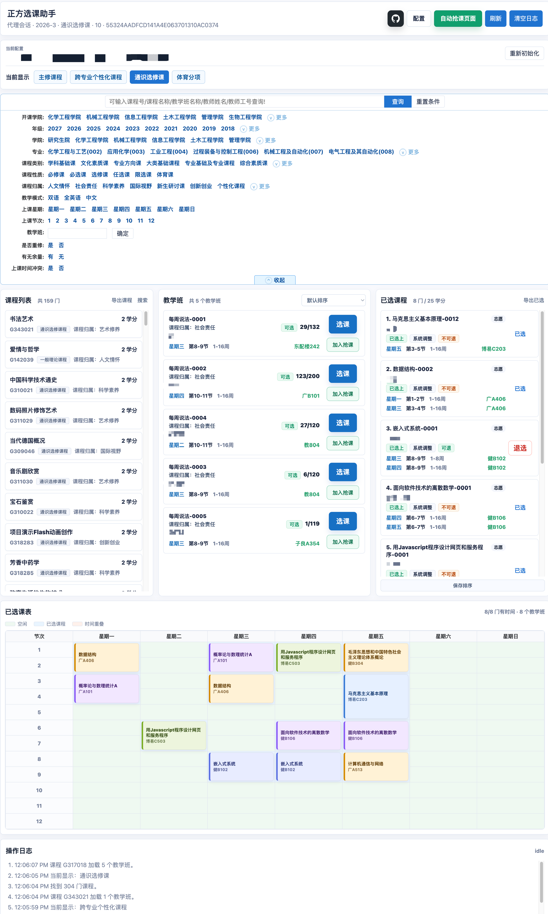
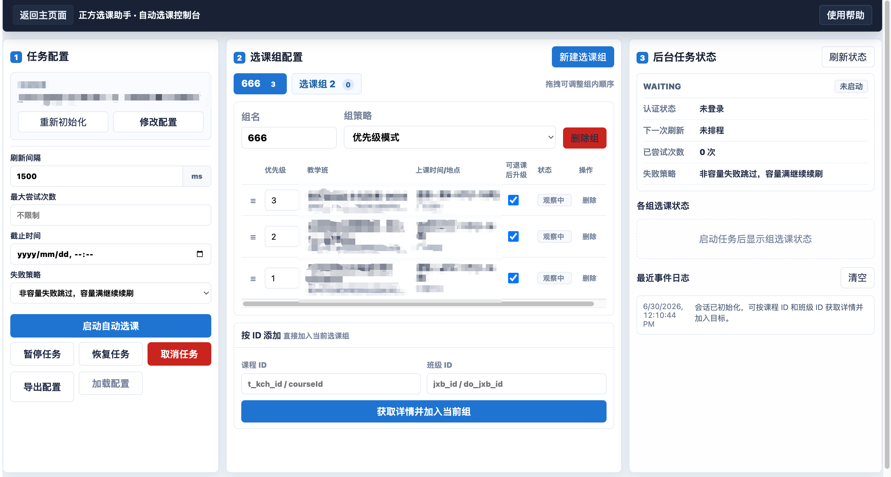

# 正方选课助手

> **免责声明**
>
> 本项目仅供学习、研究与技术交流使用，主要用于演示网络请求、流程自动化、界面交互等相关技术。开发者不鼓励、不支持任何违反学校规章制度、平台服务协议或相关法律法规的行为。
>
> 本项目为独立开发的非官方工具，与“正方软件股份有限公司”、相关高校、教务管理部门及其所属单位不存在隶属、合作、授权、认可或其他关联关系。文档中涉及的学校、系统或平台名称，仅用于说明适配对象或技术研究场景，不代表获得相关权利人的许可、认证或支持。
>
> 使用者应自行确认其使用行为符合所在学校、教务系统及相关平台的管理规定、使用协议及适用法律。因使用本项目产生的一切后果，包括但不限于账号异常、访问受限、数据丢失、选课失败、学业影响、纪律处分或其他直接、间接损失，均由使用者本人承担，与项目开发者无关。
>
> 本项目不保证功能持续可用、稳定、准确、完整、及时或适用于特定场景。教务系统接口、认证方式、访问策略、验证码机制、频率限制及校方政策可能随时调整，项目可能失效、异常或无法达到预期效果。
>
> 未经相关方明确授权，请勿将本项目用于批量请求、绕过系统限制、干扰平台正常运行、破坏公平选课秩序或其他不当用途。任何基于本项目进行的二次开发、部署、传播或商业化使用，其风险与责任均由使用者自行承担。
>
> 使用本项目即视为你已阅读、理解并同意本免责声明；如不同意，请立即停止使用并删除本项目相关内容。

`zfxk` 是一个面向正方选课系统的 Node.js SDK 与本地 Web 工作台。

它的核心方式不是模拟浏览器点击，也不依赖页面 DOM，而是基于：

- 自动登录获取 Cookie
- 已登录 Cookie
- 选课入口页隐藏字段
- 正方选课接口
- SDK 封装的 HTTP 工作流

来完成课程查询、教学班查询、已选快照、选课、退课、志愿排序以及自动选课后台任务。

## 功能概览

### SDK 能力

- 解析正方选课入口页隐藏字段。
- 自动初始化运行时上下文。
- 查询课程列表与教学班详情。
- 查询已选课程快照。
- 执行选课、退课、志愿排序。
- 支持教材、候补、监听申请等相关接口封装。
- 支持新版正方登录流程，包括滑块验证码、RSA 密码加密、Cookie 生成。
- 提供自动选课后台任务模块，支持组选课、保底占位和高优先级升级。

### Web 工作台

本地 Web 工作台提供图形化操作界面：

- 登录配置管理。
- 课程类型切换。
- 课程搜索与筛选。
- 教学班查看。
- 选课 / 退课。
- 已选课程查看。
- 已选志愿拖拽排序。
- 课程导出。
- 已选课程导出。
- 自动选课后台任务管理。

界面预览：

<table>
  <tr>
    <td align="center">
      <a href="docs/images/web-workbench-overview.png">
        
      </a>
      <br>
      <sub>Web 工作台主界面</sub>
    </td>
    <td align="center">
      <a href="docs/images/auto-selection-console.png">
        
      </a>
      <br>
      <sub>自动选课控制台</sub>
    </td>
  </tr>
</table>

### 自动选课后台任务

自动选课任务运行在本地 Node 进程中。

启动 `npm run web` 后，即使关闭浏览器页面，只要 Node 服务仍在运行，后台任务会继续工作。

支持：

- 多个选课组。
- 组内目标按 `priority` 优先级抢课。
- 只刷新目标教学班所属课程，不做全量刷课。
- 发现目标有余量后立即提交选课。
- 容量满或被抢先时继续监听。
- 非容量失败时跳过目标。
- 低优先级课程先作为保底占位。
- 高优先级目标出现余量后自动退保底并抢高优先级。
- 高优先级抢课失败后尝试恢复原保底。
- 自动使用用户名和密码续期登录。
- 支持任务配置导入 / 导出。

---

## 环境要求

- Node.js 20+
- npm

安装依赖并运行测试：

```bash
npm install
npm test
```

当前测试覆盖 SDK、登录、验证码、自动选课、Web API、导出、筛选和文档生成。

---

## 快速开始：使用 Web 工作台

启动本地工作台：

```bash
npm run web
```

打开：

```text
http://127.0.0.1:4173/
```

首次进入会跳转到 `/setup` 页面，需要填写：

| 配置项      | 说明                                                            |
| -------- | ------------------------------------------------------------- |
| Base URL | 教务系统根地址，例如 `https://example.edu.cn/jwglxt`                    |
| Path     | 选课入口页路径，例如 `/xsxk/zzxkyzb_cxZzxkYzbIndex.html?gnmkdm=N253512` |
| Cookie   | 已登录 Cookie，可手动粘贴，也可通过登录流程获取                                   |
| 用户名      | 正方账号，用于登录和自动任务续期                                              |
| 密码       | 正方密码，用于登录和自动任务续期                                              |

建议使用用户密码（如果可用的话），避免自动抢课时 Cookie 过期。

保存配置后，主页面会自动初始化选课上下文。

浏览器只访问本地接口：

```text
/api/proxy/*
/api/captcha/solve
/api/login/zfcaptcha
/api/auto-selection/*
```

真正访问学校系统的是本地 Node 代理，用于解决浏览器跨域和 Cookie 设置限制。

---

## Web 工作台使用说明

### 1. 查看课程

进入主页面后，系统会读取当前选课入口页隐藏字段，并加载课程类型。

你可以：

* 切换课程类型。
* 输入课程名或课程号搜索。
* 使用筛选条件过滤课程。
* 点击课程查看教学班。
* 查看教师、时间、地点、容量、余量、课程归属等信息。

部分条件会在浏览器本地筛选以加速体验，例如：

* 关键词
* 教学班名称
* 是否重修
* 已加载课程的课程归属

需要后端实时判断的条件仍由学校系统处理，例如：

* 年级
* 学院
* 专业
* 容量
* 时间冲突
* 可选范围

### 2. 选课 / 退课

在教学班列表中点击操作按钮：

* `选课`：调用 SDK 的 `selection.choose()`。
* `退选`：调用 SDK 的 `selection.drop()`。
* `已选`：表示当前教学班不可退或页面规则不允许退课。

已选课程快照中的 `canDrop` 会按原正方页面逻辑计算，不只是读取单个字段。它会综合判断：

* `sfktk`
* `zntgpk`
* `sfxkbj`
* 是否在选课时间内
* 已选人数是否超过退课临界人数
* 正选控制标志

### 3. 志愿排序

已选课程区域支持拖拽排序。

排序会调用正方志愿排序接口，只对普通志愿生效。权重 / 积分模式下的目标不会参与普通志愿排序。

### 4. 导出课程

点击 `导出课程` 可导出当前已加载课程的完整 JSON 信息。

导出时会：

* 按课程 ID 去重。
* 记录来源课程行数量。
* 补拉每门课的教学班详情。
* 将已知字段转换为中文可读字段。
* 保留未映射的原始字段。

### 5. 导出已选

点击 `导出已选` 可导出当前已选课程快照。

导出内容包含：

* 汇总信息。
* 已选课程。
* 已选教学班。
* 是否可退。
* 不可退原因。
* 时间、地点、教师、教学班详情。
* 必要时补拉教学班详情。

---

## 自动选课后台任务

自动选课页面位于：

```text
http://127.0.0.1:4173/auto-selection
```

自动选课任务只保存在当前 Node 进程内存中。停止 `npm run web` 后，运行中的任务会消失。

### 基本概念

自动选课以“选课组”为单位。

一个任务可以包含多个选课组，每个选课组包含多个目标教学班，需要自行检查是否组内课程是否满足可选条件。

```text
自动选课任务
  ├─ 选课组 A
  │   ├─ 高优先级教学班
  │   └─ 保底教学班
  └─ 选课组 B
      ├─ 高优先级教学班
      └─ 其他备选教学班
```

### 目标优先级

每个目标都有 `priority`。

数字越大，优先级越高。

例如：

| 教学班 | priority | 说明  |
| --- | -------: | --- |
| A1  |      100 | 最想选 |
| A2  |       80 | 次优  |
| A3  |       10 | 保底  |

自动任务会优先抢高优先级目标。

如果高优先级都不可选，但低优先级有余量，系统会先选低优先级目标作为占位。

### 保底占位与自动升级

当低优先级目标已经选上后，任务不会立刻结束。

如果之后发现更高优先级目标出现余量，系统会执行升级流程：

```text
发现高优先级有余量
  ↓
检查当前保底是否允许自动退课
  ↓
退掉低优先级保底
  ↓
立即抢高优先级目标
  ↓
成功：更新当前占位
  ↓
失败：尝试恢复原保底
```

目标默认开启 `allowAutoDrop`。如果不希望系统为了升级自动退掉某个目标，可以在目标表格取消“可退课后升级”。

### 组选课策略

自动选课组支持两种策略：

| 策略         | 说明                            |
| ---------- | ----------------------------- |
| priority   | 按优先级抢课。低优先级可保底，高优先级出现空位后尝试升级。 |
| equivalent | 组内任一目标选中即视为满足，不再追求升级。         |

### 刷新策略

自动任务采用明确目标刷新：

* 只刷新目标教学班所属课程。
* 不做全量课程搜索。
* 默认刷新间隔为 `1500ms`。
* 连续轮询异常会按 `2x`、`4x` 递增退避，最高 `16x` 基础间隔；恢复成功后回到基础间隔。
* 容量满不会跳过目标。
* 非容量业务失败默认跳过目标。

核心策略：

```text
1. priority 高的先抢
2. 只刷目标列表，不全量刷课
3. 发现余量立即提交
4. 保存返回容量满就继续刷
5. 非容量原因失败就跳过该目标
6. 成功后刷新已选快照确认
```

### 后台任务状态

任务状态包括：

| 状态        | 说明            |
| --------- | ------------- |
| queued    | 已创建，等待初始化     |
| running   | 正在后台轮询        |
| paused    | 需要人工处理        |
| succeeded | 所有选课组已满足      |
| failed    | 所有目标失败或配置不可恢复 |
| cancelled | 用户取消          |

组选课状态包括：

| 状态             | 说明             |
| -------------- | -------------- |
| WATCHING       | 正在监听目标         |
| PRECHECK       | 发现更高优先级目标，准备升级 |
| DROP_BACKUP    | 正在退当前保底        |
| CHOOSE_TARGET  | 正在提交目标教学班      |
| RECOVER_BACKUP | 高优先级失败后恢复保底    |
| SELECTED       | 当前组已有选中目标      |

### 需要人工处理的情况

自动任务默认采用保守策略。

以下情况会暂停任务或选课组，等待人工处理：

* 时间冲突需要确认。
* 教材必须选择。
* 子教学班必须选择。
* 权重 / 积分必须输入。
* 短信验证码。
* 登录需要身份确认。
* 滑块连续失败。
* 账号锁定。
* 保底恢复失败。

普通提示可以自动确认。

---

## 自动选课配置导入 / 导出

自动选课页面支持导出任务配置为 JSON 文件。

导出文件包含：

* `baseUrl`
* `pagePath`
* `username`
* `intervalMs`
* `maxAttempts`
* `deadlineAt`
* `groups`
* `targets`

导出文件不包含密码、Cookie、运行中状态、事件日志或已选快照。

导出文件不会包含：

* 密码
* Cookie
* 运行中状态
* 事件日志
* 已选快照

示例：

```json
{
  "version": 1,
  "kind": "zfxk.autoSelectionTask",
  "baseUrl": "https://example.edu.cn/jwglxt",
  "pagePath": "/xsxk/zzxkyzb_cxZzxkYzbIndex.html?gnmkdm=N253512",
  "username": "20230001",
  "intervalMs": 1500,
  "maxAttempts": null,
  "deadlineAt": null,
  "groups": [
    {
      "name": "体育课",
      "strategy": "priority",
      "targets": [
        {
          "courseId": "KC1",
          "classId": "JXB_HIGH",
          "submitClassId": "DO_HIGH",
          "label": "高优先级教学班",
          "priority": 100,
          "allowAutoDrop": true,
          "skipAfterNonCapacityFailure": true
        }
      ]
    }
  ]
}
```

加载配置时：

* 只加载为草稿。
* 不会自动启动任务。
* 不会覆盖正在运行的任务。
* 需要重新输入密码后才能启动后台任务。

---

## SDK 使用方式

### 1. 使用已有 Cookie

```js
import { createZfxkClient } from 'zfxk';

const client = createZfxkClient({
  baseUrl: 'https://example.edu.cn/jwglxt',
  auth: {
    type: 'cookie',
    cookie: process.env.ZFXK_COOKIE
  },
  mode: 'commit'
});

await client.bootstrapFromPage({
  path: '/xsxk/zzxkyzb_cxZzxkYzbIndex.html?gnmkdm=N253512'
});
```

### 2. 查询课程

```js
const courses = await client.catalog.searchCourses({
  keyword: '数据库',
  page: { start: 1, size: 20 }
});

console.log(courses);
```

### 3. 查询教学班

```js
const classes = await client.catalog.getTeachingClasses(courses[0].courseId);

const target = classes.find((item) => item.flags.canSelect);
```

### 4. 选课

```js
const result = await client.selection.choose(
  {
    courseId: target.courseId,
    classId: target.classId
  },
  {
    confirm: async () => true,
    chooseTextbooks: async ({ requiredItems }) =>
      requiredItems.map((item) => item.id)
  }
);

console.log(result.status);
```

### 5. 退课

```js
const dropResult = await client.selection.drop({
  courseId: target.courseId,
  classId: target.classId
});

console.log(dropResult.status);
```

### 6. 查询已选快照

```js
const snapshot = await client.chosen.snapshot();

console.log(snapshot.selectedCourses);
console.log(snapshot.selectedClasses);
```

---

## 登录辅助

`loginWithZfCaptcha()` 支持新版正方常见登录流程：

1. 获取滑块验证码。
2. 识别滑块位置。
3. 提交滑块轨迹。
4. 获取登录页。
5. 获取 RSA 公钥。
6. 加密密码。
7. 检查短信、身份确认、账号锁定。
8. 提交登录表单。
9. 返回认证 Cookie。

示例：

```js
import { createZfxkClient, loginWithZfCaptcha } from 'zfxk';

const login = await loginWithZfCaptcha({
  baseUrl: 'https://example.edu.cn/jwglxt',
  username: process.env.ZFXK_USERNAME,
  password: process.env.ZFXK_PASSWORD,
  maxCaptchaAttempts: 3
});

const client = createZfxkClient({
  baseUrl: 'https://example.edu.cn/jwglxt',
  auth: {
    type: 'cookie',
    cookie: login.cookieHeader
  },
  mode: 'commit'
});
```

仅需要滑块流程 Cookie 时，可使用：

```js
import { solveZfCaptcha, formatCookieHeader } from 'zfxk';
```

登录遇到交互式二次验证时，会返回明确错误码，例如：

* `SMS_LOGIN_REQUIRED`
* `IDENTITY_CONFIRMATION_REQUIRED`
* `ACCOUNT_LOCKED`

---

## 文档

生成 SDK 文档和 OpenAPI：

```bash
npm run docs
```

分别生成：

```bash
npm run openapi
npm run docs:api
```

输出：

| 文件                  | 说明               |
| ------------------- | ---------------- |
| `docs/openapi.json` | OpenAPI 3.0.3 描述 |
| `docs/api/`         | TypeDoc API 文档   |

---

## 项目结构

```text
src/
  auth/              登录流程
  captcha/           滑块验证码流程
  auto-selection/    自动选课后台任务核心
  client.js          ZfxkClient
  context.js         入口页隐藏字段解析
  endpoints.js       正方接口端点
  mappers.js         正方原始字段映射
  normalizers.js     flag / 状态归一化
  services.js        课程、教学班、选课、退课等服务

web/
  index.html         主工作台
  app.js             主工作台逻辑
  setup.html         配置页
  setup.js           配置页逻辑
  auto-selection.html 自动选课页
  auto-selection.js   自动选课页逻辑

scripts/
  serve-web.js       本地 Web/API 服务
  generate-openapi.js OpenAPI 生成

test/
  SDK、Web、自动选课、验证码、导出等测试

docs/
  OpenAPI、TypeDoc 和设计文档
```

---

## 开发命令

```bash
npm test
```

运行测试。

```bash
npm run web
```

启动本地 Web 工作台。

```bash
npm run docs
```

生成 OpenAPI 与 TypeDoc 文档。

---

## 适用范围

仅在 正方教务管理系统 版本V-9.0 下经过测试。

本项目适用于个人本机环境下，对正方选课页进行：

* 查询。
* 分析。
* 导出。
* 辅助选课。
* 自动监听目标教学班。
* 自动执行明确配置的选课任务。

不同学校的正方系统可能存在定制字段、定制端点或定制校验逻辑。遇到字段缺失、端点变化或上下文解析失败时，需要结合真实入口页和接口响应调整映射。

仓库根目录下的 `zzxkYzb*.js` 是原始页面脚本参考，用于核对端点名称、字段含义和 flag 语义。
