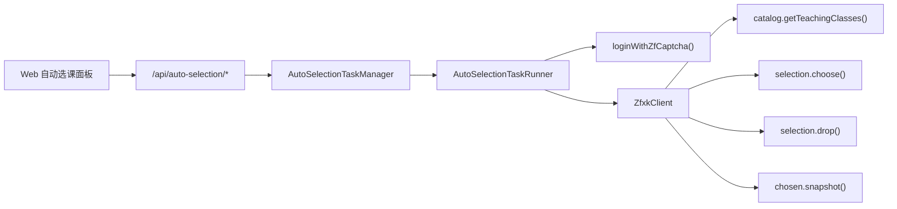
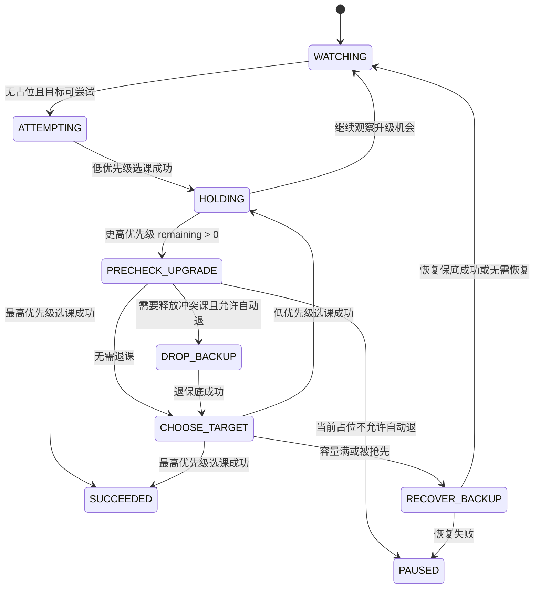

# 自动选课后台任务设计

## 背景

当前项目是面向正方 ZFXK/ZZXK 选课页的 HTTP 工作流 SDK，并提供本地 Web 工作台。现有能力已经覆盖入口页上下文解析、课程查询、教学班查询、已选快照、选课、退课、登录和滑块验证码流程。

新功能要在本地 Node 进程中运行自动选课任务。用户可以关闭浏览器页面，只要 `npm run web` 启动的 Node 服务仍在，后台任务就继续刷新目标教学班、校验状态、提交选课，并在 Cookie 过期时用账号密码重新登录。

## 目标

- 支持用户创建多个自动选课组。
- 每个选课组内按 `priority` 从高到低抢课。
- 只刷新目标教学班所属课程的教学班列表，不做全量刷课。
- 发现目标有余量并可选时立即提交。
- 保存返回容量满或被抢先时继续刷新。
- 非容量原因失败时跳过该目标。
- 成功后刷新已选快照确认结果。
- 支持低优先级课程先占位，之后发现更高优先级有空缺时自动退低优先级并抢高优先级。
- 高优先级抢课失败后尝试恢复原低优先级保底。
- 任务配置可以导出为 JSON 文件，也可以从 JSON 文件加载为草稿配置。
- 自动任务优先使用账号密码登录，Cookie 只作为可选初始凭据。

## 非目标

- 第一版不持久化运行中任务。Node 进程退出后任务消失。
- 第一版不把账号密码、Cookie、运行事件或快照写入配置文件。
- 第一版不实现远端多用户服务。
- 第一版不绕过现有 `selection.choose()` 和 `selection.drop()` 校验链路。
- 第一版不做全量课程搜索式自动匹配。关键词/筛选目标只预留模型边界，实际执行以明确教学班目标为主。

## 总体架构

自动选课逻辑放在 `src/auto-selection/`，Web 服务只负责 HTTP API 适配。这样可以避免 `scripts/serve-web.js` 承担复杂调度逻辑，也方便未来增加 CLI。

建议模块：

- `src/auto-selection/task-manager.js`：管理任务生命周期，创建、读取、取消、恢复任务。
- `src/auto-selection/task-runner.js`：单个任务的轮询调度、认证续期和写操作串行化。
- `src/auto-selection/group-runner.js`：单个选课组的状态机。
- `src/auto-selection/upgrade-runner.js`：负责 `drop -> choose -> recover` 的升级流程。
- `src/auto-selection/outcomes.js`：把选课、退课、异常和快照确认统一归一化。
- `src/auto-selection/config.js`：配置校验、默认值、导入导出结构。
- `src/auto-selection/events.js`：事件格式化和敏感字段脱敏。
- `scripts/serve-web.js`：增加 `/api/auto-selection/*` 路由，调用 `AutoSelectionTaskManager`。
- `web/app.js` / `web/index.html` / `web/styles.css`：增加自动选课控制面板。



## 任务配置模型

```json
{
  "baseUrl": "https://example.edu.cn/jwglxt",
  "username": "20230001",
  "password": "secret",
  "cookie": "optional initial cookie",
  "pagePath": "/xsxk/zzxkyzb_cxZzxkYzbIndex.html?gnmkdm=N253512",
  "intervalMs": 1500,
  "maxAttempts": null,
  "deadlineAt": null,
  "groups": [
    {
      "name": "体育课",
      "targets": [
        {
          "targetId": "KC1:JXB_HIGH:0",
          "courseId": "KC1",
          "classId": "JXB_HIGH",
          "submitClassId": "DO_HIGH",
          "label": "高优先级教学班",
          "priority": 100,
          "isBackup": false,
          "allowAutoDrop": false,
          "recoverOnUpgradeFailure": true,
          "skipAfterNonCapacityFailure": true
        },
        {
          "targetId": "KC1:JXB_BACKUP:1",
          "courseId": "KC1",
          "classId": "JXB_BACKUP",
          "submitClassId": "DO_BACKUP",
          "label": "保底教学班",
          "priority": 10,
          "isBackup": true,
          "allowAutoDrop": true,
          "recoverOnUpgradeFailure": true,
          "skipAfterNonCapacityFailure": true
        }
      ]
    }
  ]
}
```

默认值：

- `intervalMs`: `1500`
- `maxAttempts`: 不限制
- `deadlineAt`: 不限制
- `skipAfterNonCapacityFailure`: `true`
- `recoverOnUpgradeFailure`: `true`
- 同一组内目标按 `priority` 降序执行；同优先级按创建顺序执行。

运行时给每个目标生成稳定 `targetId`，格式为 `${courseId}:${classId || submitClassId}:${createdOrder}`。`label` 只用于显示，不能作为 ID。

运行时目标模型：

```ts
type AutoTarget = {
  targetId: string;
  courseId: string;
  classId: string;
  submitClassId?: string;
  label?: string;
  priority: number;
  isBackup: boolean;
  allowAutoDrop: boolean;
  recoverOnUpgradeFailure: boolean;
  skipAfterNonCapacityFailure: boolean;
  status: 'watching' | 'selected' | 'skipped' | 'failed';
  lastObservedRemaining?: number;
  lastMessage?: string;
  createdOrder: number;
};
```

## 运行状态模型

任务状态：

- `queued`：已创建，等待初始化。
- `running`：后台轮询中。
- `auth-refreshing`：会话失效后正在重新登录和重新加载入口上下文。
- `paused`：任务级暂停，或所有可运行组都需要人工处理。
- `succeeded`：所有组都已选中各自最高优先级的未跳过目标，且不再需要继续观察升级机会。
- `failed`：所有目标均被非容量失败跳过，或认证/配置无法恢复。
- `cancelled`：用户取消。

组选课状态：

- `WATCHING`：轮询目标列表。
- `ATTEMPTING`：正在尝试选择当前候选目标。
- `HOLDING`：已选中低优先级或保底目标，并继续观察高优先级目标。
- `PRECHECK_UPGRADE`：发现更高优先级目标有余量，确认当前占位是否可退。
- `DROP_BACKUP`：退掉当前低优先级占位。
- `CHOOSE_TARGET`：提交目标教学班。
- `RECOVER_BACKUP`：高优先级抢课失败后尝试恢复原保底。
- `SUCCEEDED`：已选中组内最高优先级的未跳过目标，不再需要升级。
- `PAUSED`：当前组需要人工处理。
- `FAILED`：当前组没有可继续尝试的目标。

`HOLDING` 只表示本组当前有占位目标，不代表任务完成。任务完成必须看 `isTopTargetSelected`。

建议在组状态中维护：

```ts
type AutoSelectionGroupState = {
  currentPlacement: AutoTarget | null;
  isTopTargetSelected: boolean;
  pauseScope?: 'group' | 'task';
};
```



## 调度算法

每轮调度只检查目标教学班，并且每轮开头都用已选快照重新对齐组状态，不能只相信内存里的 `currentPlacement`。

主流程：

1. 防止 tick 重入。
2. 确保已认证；必要时进入 `auth-refreshing` 后重新登录。
3. 调用 `chosen.snapshot()`。
4. `reconcileGroups()`：用快照重新计算每组 `currentPlacement` 和 `isTopTargetSelected`。
5. 按组顺序处理；跳过 `PAUSED`、`FAILED`、`SUCCEEDED` 的组。
6. 每个组只刷新目标 `courseId` 对应的教学班列表。
7. 选出最高优先级可尝试目标。
8. 无占位时选择目标。
9. 有低优先级占位时升级到更高优先级目标。
10. 写操作后刷新快照并更新组和任务状态。

写操作必须加任务级锁。同一任务内可以管理多个组，但第一版每轮最多允许一个组执行退课、选课或恢复保底，避免两个组同时改变已选快照导致误判。

```ts
async function tick(task) {
  if (task.isTicking) return;

  task.isTicking = true;
  try {
    await ensureAuthenticated(task);

    const snapshot = await task.client.chosen.snapshot();
    reconcileGroups(task.groups, snapshot);

    for (const group of task.groups) {
      if (task.writeLock) break;
      if (group.state === 'PAUSED' || group.state === 'FAILED' || group.state === 'SUCCEEDED') continue;

      const action = await planGroupAction(task, group);
      if (action.type === 'none') continue;

      await withWriteLock(task, async () => {
        if (action.type === 'choose') await chooseTarget(task, group, action.target);
        if (action.type === 'upgrade') await upgradeTarget(task, group, action.current, action.next);
      });

      break;
    }

    updateTaskStatus(task);
  } finally {
    task.isTicking = false;
  }
}

async function withWriteLock(task, operation) {
  if (task.writeLock) return;
  task.writeLock = true;
  try {
    await operation();
  } finally {
    task.writeLock = false;
  }
}
```

快照对齐规则：

```ts
function reconcileGroups(groups, snapshot) {
  for (const group of groups) {
    const selectedTarget = group.targets
      .filter((target) => snapshotHasTarget(snapshot, target))
      .sort(byPriorityDescThenCreatedOrder)[0];

    group.currentPlacement = selectedTarget ?? null;
    group.isTopTargetSelected = isGroupSucceeded(group);
  }
}

function isGroupSucceeded(group) {
  const activeTargets = group.targets.filter((target) => target.status !== 'skipped');
  if (!activeTargets.length || !group.currentPlacement) return false;
  return sameTarget(group.currentPlacement, activeTargets.sort(byPriorityDescThenCreatedOrder)[0]);
}

function updateTaskStatus(task) {
  if (task.groups.every(isGroupSucceeded)) {
    task.status = 'succeeded';
    return;
  }

  if (task.groups.every((group) => group.state === 'FAILED')) {
    task.status = 'failed';
    return;
  }

  if (task.pauseScope === 'task' || task.groups.every((group) => group.state === 'PAUSED' || group.state === 'FAILED')) {
    task.status = 'paused';
    return;
  }

  task.status = 'running';
}
```

`classId` 和 `submitClassId` 必须宽松匹配：

```ts
function matchTarget(target, teachingClass) {
  return teachingClass.classId === target.classId
    || teachingClass.submitClassId === target.submitClassId
    || teachingClass.submitClassId === target.classId
    || teachingClass.classId === target.submitClassId;
}
```

## 选课与恢复细节

选课结果先归一化，再驱动状态机：

```ts
type ChooseOutcome =
  | { type: 'selected' }
  | { type: 'pending-filter' }
  | { type: 'capacity-full'; latest?: ClassCapacity }
  | { type: 'human-required'; reason: string; pauseScope: 'group' | 'task' }
  | { type: 'business-failed'; reason: string }
  | { type: 'transient-error'; reason: string }
  | { type: 'session-expired' };
```

正常抢课：

1. 调用 `selection.choose({ courseId, classId })` 或传入已解析的 `teachingClass`。
2. `selection.choose()` 继续负责标题提示、冲突检查、教材检查和保存。
3. 返回 `selected` 或 `pending-filter` 后调用 `chosen.snapshot()` 确认。
4. 快照中能找到目标教学班时，更新组当前占位并写事件日志。
5. 如果保存成功但快照第一次没找到目标，立即再刷一次快照。
6. 二次快照仍找不到时，归类为 `transient-error` 或 `paused`，不能直接当容量满处理。

后台自动确认策略保持保守：

- 普通标题提示可以自动确认。
- 时间冲突、监听申请、教材必选、子教学班、权重或积分进入组级 `PAUSED`。
- 短信验证码、登录二次验证、账号锁定进入任务级 `paused`。
- 需要人工处理的组不继续退课或提交后续目标；其他独立组可以继续运行。

容量满处理：

- 保存接口明确返回容量满时归一化为 `capacity-full`，不跳过目标。
- 该目标继续参与后续刷新。
- 如果刚退过保底，则进入 `RECOVER_BACKUP`。
- 保存成功但快照确认失败不是 `capacity-full`，不能立即恢复保底，避免高优先级其实已选上时又选回保底。

非容量失败处理：

- 非容量失败默认把该目标标记为 `skipped`，后续不再尝试。
- 失败事件记录目标、状态码和后端消息。
- 如果所有目标都被跳过，任务失败。

自动升级：

1. 当前组已选中低优先级目标。
2. 后台发现更高优先级目标有余量且可选。
3. 刷新快照，确认当前低优先级目标仍存在且可退。
4. 只有当前占位目标 `allowAutoDrop: true` 时才自动退课。
5. 当前占位不允许自动退时，当前组进入 `PAUSED`，原因是无法自动升级。
6. 调用 `selection.drop()` 退低优先级目标。
7. 退课成功后立即调用 `selection.choose()` 抢高优先级目标。
8. 高优先级成功后刷新快照并更新当前占位。

恢复保底：

- 如果高优先级保存返回容量满或被抢先，且原占位 `recoverOnUpgradeFailure: true`，立即尝试重新选择原低优先级目标。
- 如果高优先级保存成功但快照确认失败，先二次刷新快照；仍找不到时暂停或记录瞬时错误，不能直接恢复保底。
- 恢复成功后回到 `WATCHING`。
- 恢复失败时任务 `paused`，事件日志说明“保底已释放但恢复失败”，避免继续误操作。

## 认证与续期

自动任务优先使用账号密码：

1. 任务启动时调用 `loginWithZfCaptcha()`。
2. 登录成功后创建带 Cookie 的 `ZfxkClient`。
3. 调用 `bootstrapFromPage({ path: pagePath })` 加载运行时上下文。
4. 后续轮询使用内存中的 Cookie。

遇到会话失效时自动续期：

- `SESSION_EXPIRED`
- `CONTEXT_NOT_FOUND`
- 入口页返回登录页或缺少必要上下文字段
- 后端返回非法访问类错误

续期流程：

1. 暂停当前轮写操作。
2. 重新调用 `loginWithZfCaptcha()`。
3. 重新 `bootstrapFromPage()`。
4. 成功后回到原状态继续轮询。

认证续期不能和写操作交叉。退课、选课、恢复保底期间不主动触发后台重新登录；如果写操作中遇到 `session-expired`，当前 action 先失败并进入受控恢复流程：

1. 任务状态变为 `auth-refreshing`。
2. 重新登录并重新加载入口 context。
3. 刷新已选快照。
4. 用快照判断高优先级是否已选上、原保底是否还存在。
5. 如果退保底已成功但高优先级未选上，并且原目标允许恢复，立即进入 `RECOVER_BACKUP`。
6. 如果快照状态无法判断，任务进入 `paused`，等待人工处理。

需要人工处理时按范围暂停：

- 滑块连续失败、账号锁定、登录短信或身份确认：任务级 `paused`。
- 选课流程需要短信验证码：任务级 `paused`。
- 教材必须选择但没有默认策略：组级 `PAUSED`。
- 子教学班必须选择：组级 `PAUSED`。
- 权重或积分必须输入：组级 `PAUSED`。

敏感信息处理：

- 密码和 Cookie 只保存在 Node 进程内存。
- API 响应不返回密码或完整 Cookie。
- 事件日志不写入密码、Cookie 或完整认证头。
- `statusquo.md` 不记录凭据。

## 后台 API

新增接口：

- `POST /api/auto-selection/tasks`：创建并启动任务。
- `GET /api/auto-selection/tasks`：列出当前 Node 进程内任务。
- `GET /api/auto-selection/tasks/:id`：读取任务状态。
- `GET /api/auto-selection/tasks/:id/events`：读取任务事件日志；第一版使用普通轮询，不做 SSE。
- `POST /api/auto-selection/tasks/:id/cancel`：取消任务。
- `POST /api/auto-selection/tasks/:id/resume`：人工处理后恢复暂停任务。
- `POST /api/auto-selection/config/validate`：校验草稿配置。
- `POST /api/auto-selection/config/import`：导入配置文件内容并返回规范化草稿，不创建任务。

任务状态响应示例：

```json
{
  "id": "task_abc",
  "status": "running",
  "usernameMasked": "****0001",
  "authStatus": "logged-in",
  "attempts": 42,
  "intervalMs": 1500,
  "nextRunAt": "2026-06-29T13:30:00.000Z",
  "groups": [
    {
      "name": "体育课",
      "state": "HOLDING",
      "currentTargetId": "KC1:JXB_BACKUP",
      "currentPriority": 10,
      "isTopTargetSelected": false,
      "targets": [
        {
          "targetId": "KC1:JXB_HIGH",
          "priority": 100,
          "status": "watching",
          "lastMessage": "capacity full"
        }
      ]
    }
  ],
  "events": []
}
```

## 前端设计

在现有 Web 工作台中增加“自动选课”面板。

任务配置区：

- 复用当前 `Base URL`、用户名、密码和 `Path`。
- 刷新间隔默认 `1500ms`，允许调整。
- 支持最大尝试次数和截止时间，可为空。
- 启动按钮创建后台任务。
- 取消按钮停止后台任务。

选课组区：

- 教学班卡片增加“加入自动选课”按钮。
- 按钮使用已解析的教学班数据写入 `courseId`、`classId`、`submitClassId`、课程名和教学班名。
- 用户选择或创建选课组。
- 目标列表可编辑 `priority`、`isBackup`、`allowAutoDrop`。
- 组内按优先级展示。
- 多组选课互不共享目标，但写操作由后台串行化。
- 手填 `courseId` / `classId` 只作为高级模式，不作为主要操作路径。

任务状态区：

- 显示当前任务状态、认证状态、下一次刷新时间、尝试次数。
- 显示每组当前占位、目标状态、最近事件。
- 页面重新打开时调用 `GET /api/auto-selection/tasks` 恢复展示。

## 配置导入导出

导出文件格式：

```json
{
  "version": 1,
  "kind": "zfxk.autoSelectionTask",
  "baseUrl": "https://example.edu.cn/jwglxt",
  "pagePath": "/xsxk/zzxkyzb_cxZzxkYzbIndex.html?gnmkdm=N253512",
  "username": "20230001",
  "intervalMs": 1500,
  "maxAttempts": null,
  "deadlineAt": null,
  "groups": [
    {
      "name": "体育课",
      "targets": [
        {
          "targetId": "KC1:JXB_HIGH:0",
          "courseId": "KC1",
          "classId": "JXB_HIGH",
          "submitClassId": "DO_HIGH",
          "label": "高优先级教学班",
          "priority": 100,
          "isBackup": false,
          "allowAutoDrop": false,
          "recoverOnUpgradeFailure": true,
          "skipAfterNonCapacityFailure": true
        }
      ]
    }
  ]
}
```

导出默认不包含：

- `password`
- `cookie`
- 运行中状态
- 事件日志
- 已选快照

加载行为：

- 加载为草稿配置，不自动启动任务。
- 校验 `kind`、`version`、`groups` 和 `targets`。
- 缺少 `courseId`、`classId` 或 `priority` 的目标标记为无效。
- 不覆盖正在运行的后台任务。
- 用户重新输入密码后才能启动后台任务。
- 加载配置时只更新编辑区，不自动创建或启动后台任务。

## 错误处理

- 容量满：目标继续观察。
- 非容量失败：跳过目标，记录原因。
- 瞬时错误：记录错误，按退避策略下轮重试。
- 目标找不到：本轮跳过，不永久失败。
- 已选快照显示目标已选：视为成功并更新当前占位；如果是最高优先级目标，组进入 `SUCCEEDED`。
- 当前占位不可退：升级流程暂停，等待人工处理。
- 退保底成功但抢高优先级失败：尝试恢复保底。
- 恢复保底失败：任务暂停。
- 登录失效：自动重新登录并刷新 context。
- 登录需要人工交互：任务暂停。

## 测试方案

单元测试：

- 配置校验：默认值、排序、无效目标、导入导出不包含密码和 Cookie。
- 调度排序：高优先级先尝试，同优先级保持创建顺序。
- 目标刷新：只调用目标 `courseId` 的教学班接口，不触发全量课程搜索。
- 容量满：目标不被跳过，下一轮继续观察。
- 非容量失败：目标被 skipped。
- 成功选课：调用快照并更新组选中状态。
- 自动升级：发现高优先级有余量后退低优先级并选高优先级。
- 恢复保底：高优先级容量满后尝试重新选择低优先级。
- 认证续期：会话失效后重新登录、重新 bootstrap，并继续调度。
- 快照对齐：内存 `currentPlacement` 为 A，但快照显示用户手动退掉 A，下一轮应清空 `currentPlacement`。
- 手动升级对齐：后台持有低优先级时，用户手动选中高优先级，下一轮组应直接进入 `SUCCEEDED`。
- 升级恢复：退保底成功、选择高优先级容量满、恢复保底成功。
- 升级中会话失效：退保底成功、选择高优先级遇到 `session-expired`，重新登录、刷新快照，并按快照决定是否恢复保底。
- 保存成功但快照确认失败：不会立刻恢复保底，会二次刷新或进入 `transient-error` / `paused`。

Web/API 测试：

- `POST /api/auto-selection/tasks` 创建任务时脱敏响应。
- `GET /api/auto-selection/tasks` 能返回运行中任务。
- `cancel` 能停止定时器并改变状态。
- 前端存在自动选课面板、加入按钮、导入导出按钮和任务状态区域。

人工验证：

- 启动 `npm run web`。
- 用测试账号创建自动选课任务。
- 关闭浏览器页面，等待后台事件继续增加。
- 重新打开页面，确认任务仍存在。
- 导出配置，加载配置，确认密码未写入文件且配置能回填。

## 实施顺序

1. Contracts：配置 schema、目标规范化、导入导出脱敏和 outcome normalizer。
2. Core：`task-runner`、`group-runner`、`upgrade-runner`、快照对齐和写操作锁。
3. Tests：先覆盖调度器、升级、恢复和续期单元测试。
4. API：在 `scripts/serve-web.js` 增加自动选课路由。
5. UI：增加自动选课面板、加入目标按钮和任务状态展示。
6. Import/export：接入 JSON 配置导入导出草稿。
7. Docs：更新 `src/index.d.ts`、OpenAPI 和 README。
8. Verification：运行测试并做一次本地 Web 验证。

## 第一版范围

第一版实现：

- 创建、查看、取消任务。
- 组选课。
- 保底占位。
- 高优先级升级。
- 失败恢复。
- 账号密码登录。
- 会话失效重登。
- JSON 配置导入导出草稿。

第一版暂缓：

- 关键词目标。
- 筛选目标。
- SSE 实时日志。
- 持久化任务。
- 多任务并发优化。
- 自动教材选择。
- 自动权重填写。
- 自动子教学班选择。

## 风险与约束

- 退低优先级再抢高优先级不是服务端原子操作，存在保底丢失风险。第一版通过 `allowAutoDrop` 显式授权和 `RECOVER_BACKUP` 降低风险，但不能完全消除。
- 激进刷新可能触发学校服务端限流。第一版默认 1500ms，但应保留失败退避。
- 自动登录依赖现有滑块识别模板，不保证所有学校部署都可用。
- 不持久化任务意味着 Node 进程退出会丢失后台任务，这是第一版刻意接受的取舍。
